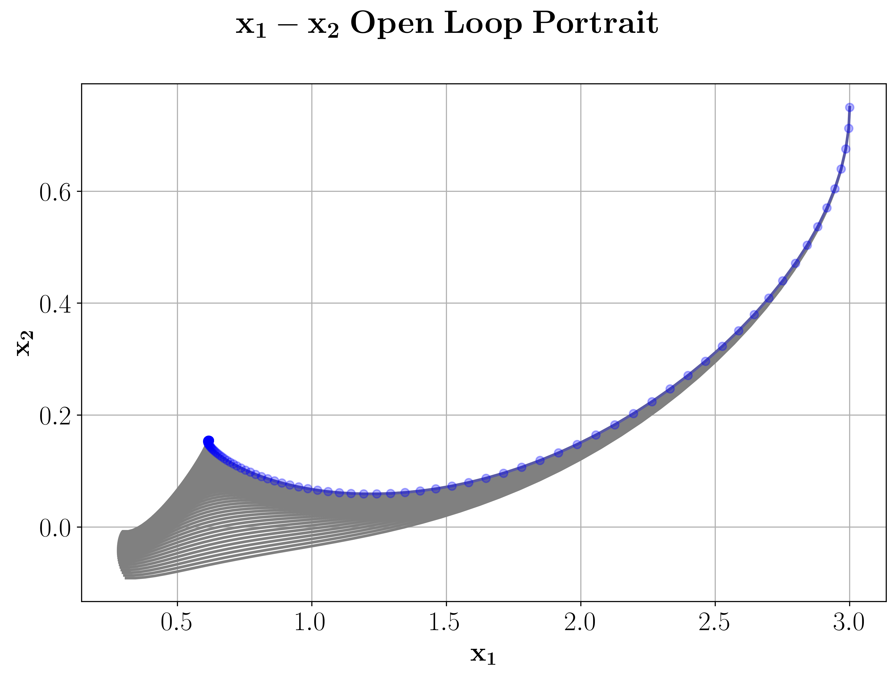
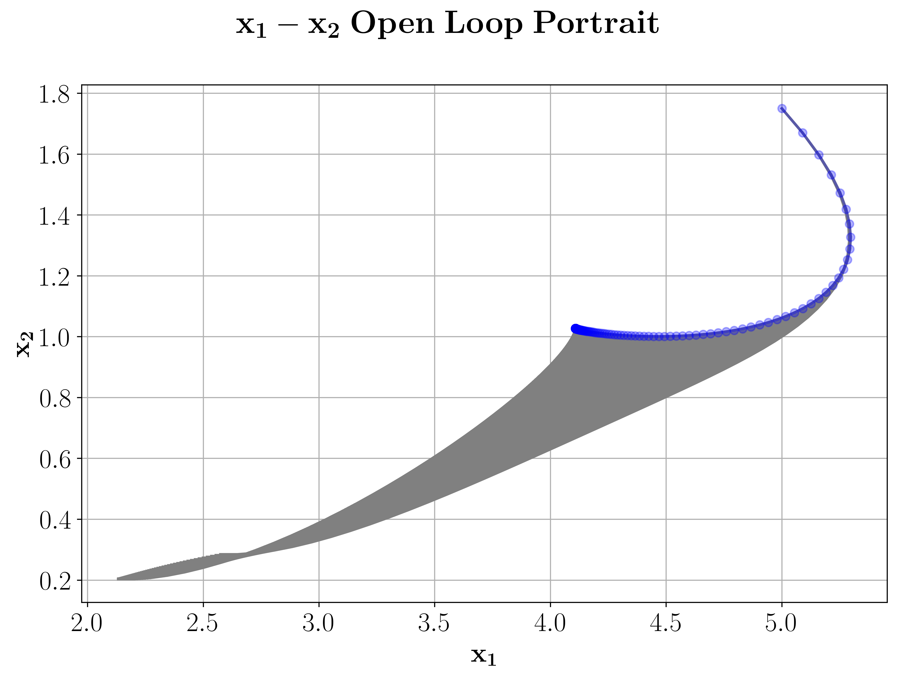

2d Investment Problem
======================

To examplify a discounted problem we consider a 2d variant of an investment problem, originally introduced in :cite:p:`Haunschmied2003` and furhter explored in :cite:p:`Gruene2015`.

The system dynamics for this problem are given by 

.. math::

   \dot{x}_1(t) &= x_2(t) - \sigma x_1(t) \\ 
   \dot{x}_2(t) &= u(t)

where we set :math:`\sigma = 0.25` for our calculations.

To implement the dynamics we have to initialize a function that implements the right hand side of the dynamics.

.. code-block:: python

   sigma = 0.25
   def f(x,u):
       y = nmpyc.array(2)
       y[0] = x[1]-sigma *x[0]
       y[1] = u
       return y

After that, the nMPyC system object can be set by calling

.. code-block:: python

   system = nmpyc.system(f, 2, 1, 'continuous', sampling_rate=0.2, method='heun')

To model the payoff of the investment problem we assume th stage cost

.. math::

   \ell(x,u) = R(x_1) - c(x_2) - v(u)

where :math:`R(x_1) = k_1 \sqrt{x_1} - x_1/(1+k_2 x_1^4)` is a revenue function of the firm with a
convex segment due to increasing returns. :math:`c(x_2) = c_1 x_2 + c_2 x_2^2/2` denotes adjustment costs
of investment and :math:`v(u) = \alpha u^2/2` represents adjustment costs of the change of investment.
The convex segment in the payoff function just mentioned is likely to generate two domains
of attraction.
Additionally we choose :math:`k_1=2`, :math:`k_2=0.0117`, :math:`c_1=0.75`, :math:`c_2=2.5` and :math:`\alpha=12` for our computations.

With the nMPyC package the implemnetiation of the objective corresponding to this costs can be done as follws.

.. code-block:: python

   def l(x,u):
       R = k1*x[0]**(1/2)-x[0]/(1+k2*x[0]**4)
       c = c1*x[1]+(c2*x[1]**2)/2
       v = (alpha*u[0]**2)/2
       return -(R - c - v)

   objective = nmpyc.objective(l)

Since this problem is unconstrained we can now initialize our model by 

.. code-block:: python

   model = nmpyc.model(objective,system)

For our simulation we assume set the discount factor to 

.. math::

   \beta = e^{-\delta h}

where :math:`h=0.2` is our samplimng rate and :math:`\delta=0.04` is the continuous discount rate.

It can now be shown that this problem has two domains of attraction, one at roughly :math:`x^* = (0.5, 0.2)` and the other roughly at :math:`x^* = (4.2, 1.1)`. 
Now we choose ifferent initial values from both domains of attraction to test, if we can replicate the two domains of attraction for a finite decision horizon by using nonlinear model predictive control.
For this purpose we set the MPC horizon :math:`N=50` and the number of MPC iterations to :math:`K=500`. 

This leads to the following code for running the closed loop simulation for the discounted problem.

.. code-block:: python

   discount = nmpyc.exp(-0.04*0.2)
   N = 50
   K = 500

   x0 = nmpyc.array([3.0,0.75])
   res1 = nmpyc.mpc(x0,N,K,discount)

   x0 = nmpyc.array([5.0,1.75])
   res2 = nmpyc.mpc(x0,N,K,discount)

Looking at the phase portraits of the two simulations, we can confirm that we really converge against the two different equilibria with the closed loop trajectory.
The phase portraits of our simulations can be plotted with the nMPyC package by calling

.. code-block:: python 

   res1.plot('phase', phase1='x_1', phase2='x_2', show_ol=True)
   res2.plot('phase', phase1='x_1', phase2='x_2', show_ol=True)

The option :code:`show_ol=True` will also plot the pahase portraits of the open loop simulations of each iteration, which leads the output below. 

