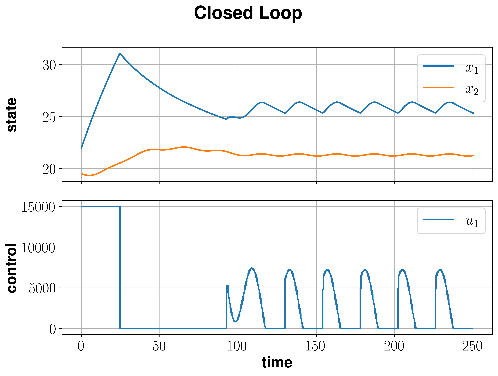

Heat Pump
==========

This example describes a home heating system that involves the optimal control of a small heat pump coupled to a floor heating system. The corresponding dynamic model is introduced in :cite:p:`Logist2010` and is given by

.. math::
   :nowrap:
   
   \begin{align}
	\dot{x_1} &= \dfrac{-k_{WR}}{\rho_W c_W V_H}x_1 + \dfrac{k_{WR}}{\rho_W c_W V_H}x_2 + \dfrac{1}{\rho_W c_W V_H}u\\
	\dot{x_2}&= \dfrac{k_{WR}}{k_G \tau_G}x_1 -\dfrac{k_{WR}+k_G}{k_G\tau_G}x_2 +\dfrac{1}{\tau_G} T_{\text{amb}},
   \end{align}
   
where :math:`x_1` denotes the temperature of the water returning from the heating, :math:`x_2` denotes the room temperature and :math:`u` is the heat supplied from the heat pump to the floor. Further, the ambient temperature

.. math::
   T_\text{amb}(t) = 2.5 + 7.5 \sin\left(\frac{2\pi t}{t_f}-\frac \pi 2\right)
   
describes a sinusoidal disturbance from the outside temperature where :math:`t_f = 24`. The remaining constants are summarized in the table below.

============================================================ ================  ============  ================
   Reactor constants
-------------------------------------------------------------------------------------------------------------
            \                             \                                      value          unit
============================================================ ================  ============  ================
density of the water                                          :math:`\rho_W`     997          :math:`kg/m^3`
specific heat capacity of water                               :math:`c_W`        4.1851       :math:`J/kgK`     
volume of the water                                           :math:`V_H`        7.4          :math:`m^3` 
thermal conductivity between water and the room               :math:`k_{WR}`     510          :math:`W/K`
thermal conductivity between the room and the environment     :math:`k_G`        125          :math:`W/K`
thermal time constant of the room                             :math:`\tau_G`     260          :math:`s`
============================================================ ================  ============  ================

First, we have to implement the outside temperature in the code to define our system dynamics.

.. code-block:: python

   t_f = 24
   def T_amb(t):
    return 2.5 + 7.5*nmpyc.sin((2*nmpyc.pi*t)/t_f - (nmpyc.pi/2))

After that, we can define the right hand side of the system by

.. code-block:: python

   rho_W = 997
   c_W = 4.1851
   V_H = 7.4
   k_WR = 510
   k_G = 125
   thau_G = 260
   def f(t,x,u):
      y = nmpyc.array(2)
      y[0] = (-k_WR/(rho_W*c_W*V_H)*x[0] 
               + k_WR/(rho_W*c_W*V_H)*x[1] 
               + 1/(rho_W*c_W*V_H)*u[0])
      y[1] = (k_WR/(k_G*thau_G)*x[0] 
               - (k_WR + k_G)/(k_G*thau_G)*x[1] 
               + (1/thau_G)*T_amb(t))
      return y

And finally initialize the system by

.. code-block:: python

   system = nmpyc.system(f, 2, 1, 'continuous', sampling_rate=0.5, method='euler')

In the heating system the conflict between energy and thermal comfort arises. Thus, the stage cost reads

.. math::
   :nowrap:
   
   \begin{align*}
	\ell(x,u)&=\frac u P_{\max} + (x_2-T_\text{ref})^2,
   \end{align*}
   
where :math:`P_{\max} = 15000 (W)` is the maximal power of the heating pump and :math:`T_\text{ref} = 22^{\circ} C` is the desired temperature of the room. The reference temperature :math:`T_\text{ref}` can be selected differently -- depending on the thermal comfort.

According to this we can initialize our objective by 

.. code-block:: python

   P_max = 15000
   T_ref = 22
   def l(x,u):
      return (u[0]/P_max) + (x[1]-T_ref)**2

and implement the control constraint 

.. math::

   0 \leq u(t) \leq P_{max} 

as

.. code-block:: python

   constraints = nmpyc.constraints()
   constraints.add_bound('lower', 'control', nmpyc.array([0]))
   constraints.add_bound('upper', 'control', nmpyc.array([P_max]))

After all components of the optimal control problem have been implemented, we can now combine them into a model and start the MPC loop. For this Purpose, we define

.. math::

   x(0) = (22, 19.5)^t

and set :math:`N=30` and :math:`K=500`.

.. code-block:: python

   model = nmpyc.model(objective,system,constraints)
   x0 = nmpyc.array([22., 19.5])
   res = model.nmpyc(x0,N,K)   

Following the simulation we can visualize the results by calling 

.. code-block:: python

   res.plot()

which generates the plot bellow.

