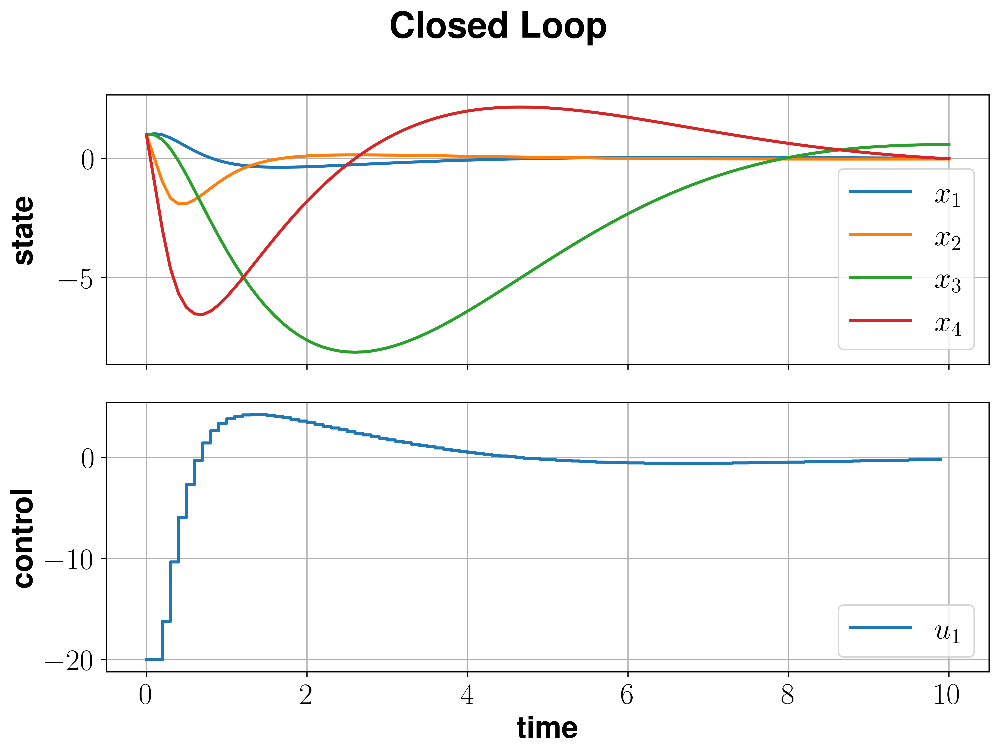
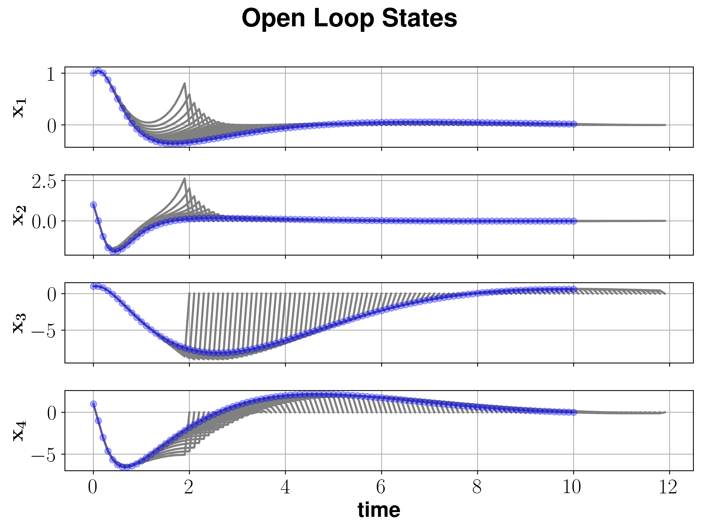

Inverted Pendulum
==================

We consider the mechanical model of an inverted rigid pendulum mounted on a carriage, see :cite:p:`Gruene2021a`, :cite:p:`Gruene2017a`.

By means of physical laws an "exact" differential equation model can be derived.
However, since in our case we like to obtain a linear quadratic problem, 
we linearize the differential equation at the origin.
Thus, we obtain the system dynamics defined by 

.. math::

   \dot{x}(t) = \left(\begin{array}{cccc} 
      0 & 1 & 0 & 0 \\
      g & -k & 0 & 0 \\
      0 & 0 & 0 & 1 \\
      0 & 0 & 0 & 0
   \end{array}\right) x(t) + \left(\begin{array}{c} 
      0  \\
      1  \\
      0  \\
      1 
   \end{array}\right) u(t).

Here, the state vector :math:`x \in \mathbb{R}^4` consists of 4 components. :math:`x_1` corresponds to the angle :math:`\psi` of the pendulum, which increases counterclockwise, where :math:`x_1 = 0` corresponds to the upright pendulum. :math:`x_2` is the angular velocity, :math:`x_3` the position of the carriage and :math:`x_4` its velocity. 
The control :math:`u` is the acceleration of the carriage. 
The constant :math:`k=0.1` describes the friction of the pendulum and the constant :math:`g \approx 9.81 m/s^2` is the acceleration due to gravity.

Since the system dynamics are linear, we can initialize them using the LQP method. 

.. code-block:: python
   
   g = 9.81
   k = 0.1
   A = nmpyc.array([[0, 1, 0, 0], 
                    [g, -k, 0, 0], 
                    [0, 0, 0, 1],
                    [0, 0, 0, 0]])
   B = nmpyc.array([0, 1, 0, 1])
   system = nmpyc.system.LQP(A, B, 4, 1, 'continuous', 
                             sampling_rate=0.1, method='rk4')

Note that we have to use one of the fixed step methods as *euler*, *heun* or *rk4* as integration method if we like to exploit the linear quadratic structure of the problem in the optimization.

In the next step, we have to define the objective of the optimal control problem. 
In doing so, we assume the stage cost

.. math::
   
   \ell(x,u) = 2x^Tx + 4u^Tu.

Since we assume no terminal cost, we can implement the objective as shown in the following code snippet.

.. code-block:: python

   Q = 2*nmpyc.eye(4)
   R = 4*nmpyc.eye(1)  
   objective = nmpyc.objective.LQP(Q, R)

Again, we use the LQP method to exploit the linear quadratic structure of the problem later.

In terms of the constraints we assume the state constraints 

.. math::

    -9 \leq x_i(t) \leq 5 

for :math:`i=1,\ldots,4` and the control constraint 

.. math::

   -20 \leq u(t) \leq 6 \quad 

This can be realized in the code as 

.. code-block:: python

   constraints = nmpyc.constraints()
   lbx = nmpyc.zeros(4)*(-9)
   ubx = nmpyc.ones(4)*5
   constraints.add_bound('lower','state', lbx)
   constraints.add_bound('upper','state', ubx)
   constraints.add_bound('lower', 'control', mpc.array([-20]))
   constraints.add_bound('upper', 'control', mpc.array([6]))

After all components of the optimal control problem have been implemented, we can now combine them into a model and start the MPC loop.
For this Purpose, we define the inital value

.. math::

   x(0) = (1,1,1,1)^T 

and set :math:`N=20`, :math:`K=100`.

.. code-block:: python

   model = nmpyc.model(objective,system,constraints)
   x0 = nmpyc.array([1, 1, 1, 1]) 
   res = model.mpc(x0,20,100)

Since the problem is linear-quadratic, the program automatically takes advantage of this fact and uses the appropriate solver osqp.
To change this and use for example the SciPy solver SLSQP, we can use the `set_options` method before calling model.mpc().

.. code-block:: python

   model.opti.set_options(dict(solver='SLSQP'))

Note that changing the optimizer usually does not have any advantage and is therefore not necessarily recommended.
At this point we only like to demomnstrate the use of this function. 

Following the simulation we can visualize the open and closed loop results by calling 

.. code-block:: python

   res.plot() # plot closed loop results
   res.plot('state', show_ol=True) # plot open loop states

which generates the plots bellow.

