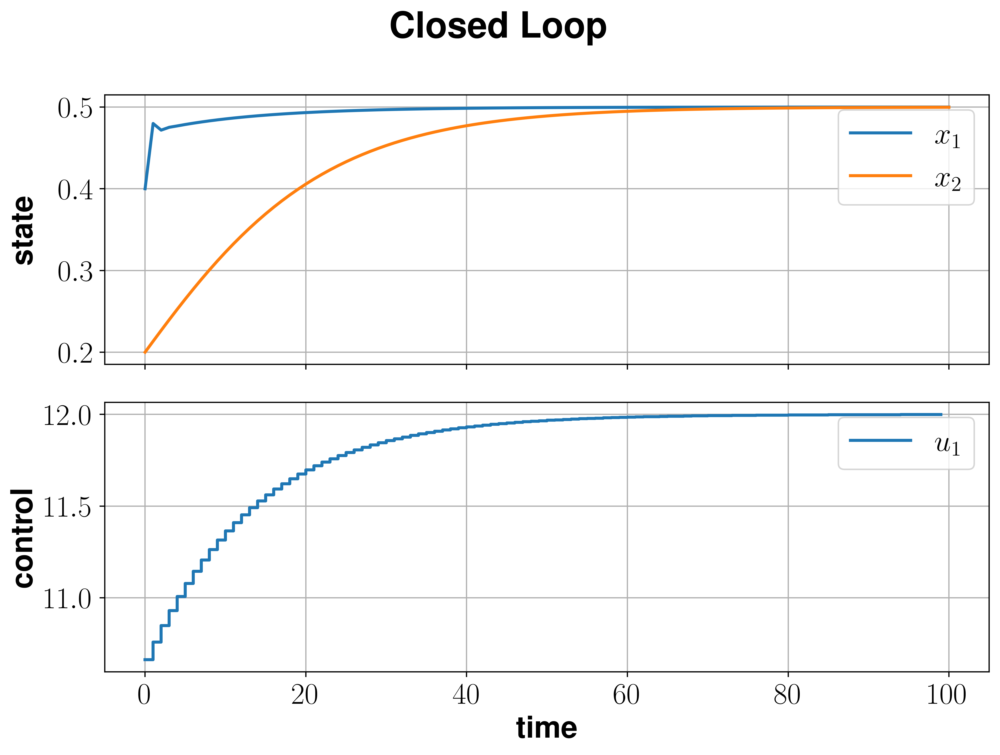

Chemical Reactor
=================

We consider a single first-order, irreversible chemical reaction in an isothermal CSTR

.. math::

   A \to B.
   
The material balances and the system data are provided in :cite:p:`Diehl2011` and is given by the nonlinear model

.. math::
   :nowrap:
   
   \begin{equation*}
      \begin{split}
         c_{A}(k+1)&=c_{A}(k)+h\left(\frac{Q(k)}{V}(c_f^{A}-c_{A}(k))-k_r{c_{A}(k)}\right)\\
         c_{B}(k+1)&=c_{B}(k)+h\left(\frac{Q(k)}{V}(c_f^{B}-c_{B}(k))+k_r{c_{B}(k)}\right),
      \end{split}
   \end{equation*}
   
in which :math:`c_A\geq 0` and :math:`c_B\geq 0` are the molar concentrations of :math:`A` and :math:`B` respectively, and :math:`Q\leq 20` (L/min) is 
the flow through the reactor. The constants and their meanings are given in table below.

================================ =============================  =====================================  ================
   Reactor constants
-----------------------------------------------------------------------------------------------------------------------
            \                             \                                 value                           unit
================================ =============================  =====================================  ================
feed concentration of :math:`A`   :math:`c_f^{A}`                                  1                        mol/L
feed concentration of :math:`B`   :math:`c_f^{B}`                                  0                        mol/L
volume of the reactor             :math:`V_R`                                     10                          L
rate constant                     :math:`k_r`                                     1.2                    L/(mol min)
equilibrium                       :math:`(c_e^{A},c_e^B,Q_e)`    :math:`(\frac 1 2, \frac 1 2, 12)`
initial value                       :math:`(c_0^{A},c_0^B)`        :math:`(0.4, 0.2)`
================================ =============================  =====================================  ================

To initialize the system dynamics a function that implements :math:`f(x,u)`, where :math:`x = (c_{A},c_{B})^T` and :math:`u=Q` has to be defined.

.. code-block:: python
   
   V = 10.
   cf_A = 1.
   cf_B = 0.
   k_r = 1.2

   def f(x,u):
       y = nmpyc.array(2)
       y[0] = x[0] + 0.5*((u[0]/V) *(cf_A - x[0]) - k_r*x[0])
       y[1] = x[1] + 0.5*((u[0]/V) *(cf_B - x[1]) + k_r*x[1])
       return y

After that, the nMPyC system object can be set by calling

.. code-block:: python

   system = nmpyc.system(f, 2, 1, system_type='discrete')

In the next step, the objective is defined by using the stage cost given by

.. math::
   :nowrap:
   
   \begin{align*}
      \ell (c_{A}(k),c_{B}(k),Q(k))&=\frac 1 2\vert c_A(k)-\frac 1 2\vert^2+\frac 1 2 \vert c_B(k)-\frac 1 2\vert^2+\frac 1 2 \vert Q(k) -12 \vert^2\\
   \end{align*}

Since we do not need terminal cost, we can initialize the objective directly using the following implementation.

.. code-block:: python

   def l(x,u):
       return 0.5 * (x[0]-0.5)**2 + 0.5 * (x[1]-0.5)**2 + 0.5 * (u[0]-12)**2

   objective = nmpyc.objective(l)

In terms of the constraints we assume that 

.. math::

   0 &\leq x_1(k) & &\text{for } k=0,\ldots,N \\
   0 &\leq x_2(k) & &\text{for } k=0,\ldots,N \\
   0 &\leq u(k) &\leq 20 &\text{for } k=0,\ldots,N-1.

This can be realized in the code as follows:

.. code-block:: python

   constraints = nmpyc.constraints()
   lbx = nmpyc.zeros(2)
   ubu = nmpyc.ones(1)*20
   lbu = nmpyc.zeros(1)
   constraints.add_bound('lower','state', lbx)
   constraints.add_bound('lower','control', lbu)
   constraints.add_bound('upper','control', ubu)

Moreover, we consider the equilibrium :math:`(c_e^{A},c_e^B,Q_e)` as th terminal condition for our optimal control problem, which is implemented as 

.. code-block:: python

   xeq = nmpyc.array([0.5,0.5])
   def he(x): 
       return x - xeq
   constraints.add_constr('terminal_eq', he)   

After all components of the optimal control problem have been implemented, we can now combine them into a model and start the MPC loop.
For this Purpose, we define

.. math::

   x(0) = (0.4,0.2)^T 

and set :math:`N=15`, :math:`K=100`.

.. code-block:: python

   model = mpc.model(objective,system,constraints)
   x0 = mpc.array([0.4,0.2])
   res = model.mpc(x0,15,100)

Following the simulation we can visualize the results by calling 

.. code-block:: python

   res.plot()

which generates the plot bellow.

